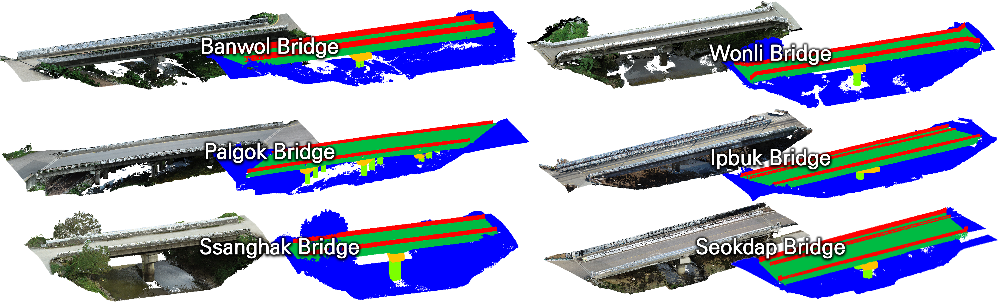

# UAV-LiDAR Bridge Dataset

[](https://doi.org/10.1016/j.autcon.2026.107045)
[](https://zenodo.org/uploads/18531104)

Official repository for the paper: **"UAV LiDAR bridge point cloud dataset and hybrid deep learning framework for robust semantic segmentation"** published in *Automation in Construction*.

---

## 📌 Overview

The following figure shows representative LiDAR point cloud samples from six bridge sites included in the UAV-LiDAR Dataset.
Each example visualizes the semantic components of the bridge structures.


---

## 📥 Download the Dataset

The dataset can be downloaded from Zenodo:

👉 **[Download Dataset via Zenodo](https://zenodo.org/uploads/18531104)**

*The compressed packages include raw point cloud files (`.bin`), annotated files (`.ply`).*

---

## 🧩 Dataset Description

- **Platform**: DJI Matrice 300 RTK
- **Sensor**: DJI Jenmuse L1 LiDAR
- **Data format**: Cloud Compare raw point cloud(`.bin`) and anotated components(`.ply`)
- **Number of samples**: 6 Datasets

---

## 📊 Dataset Composition

The table below summarizes the point distribution by bridge component class across the four bridge sites.

| Class | Banwol | Palgok | Ssanghak | Wonli | Ipbuk | Seokdap  |
| :--- | :---: | :---: | :---: | :---: | :---: | :---: |
| **Background** | 8,895,556 | 7,771,527 | 6,974,137 | 5,795,047 | 11,083,066 | 6,744,819 |
| **Superstructure** | 13,412,111 | 6,380,560 | 5,164,051 | 6,277,791 | 13,077,969 | 7,736,190 |
| **Column** | 152,193 | 462,261 | 566,678 | 135,312 | 225,958 | 245,512 |
| **Pier Cap** | 572,463 | 755,539 | 542,155 | 316,920 | 1,407,154 | 762,421 |
| **Guardrail** | 3,237,522 | 1,230,855 | 974,353 | 1,319,601 | 2,190,442 | 1,488,608 |
| **Total** | **26,269,845** | **16,600,742** | **14,221,374** | **13,844,671** | **27,984,589** | **16,977,550** |

---

## 📑 License

This dataset is released for **academic research purposes only**.

---

## 📖 Citation

If you use this dataset or the framework in your research, please cite our paper:

* [https://doi.org/10.1016/j.autcon.2026.107045](https://doi.org/10.1016/j.autcon.2026.107045)

```bibtex
@article{lee2026uav,
  title={UAV LiDAR bridge point cloud dataset and hybrid deep learning framework for robust semantic segmentation},
  author={Lee, Changjun and Ko, Dongyoung and Maru, Michael Bekele and Jang, Kitae and Choi, Woongyu and Cha, Gichun and Park, Seunghee},
  journal={Automation in Construction},
  volume={188},
  pages={107045},
  year={2026},
  publisher={Elsevier},
  doi={10.1016/j.autcon.2026.107045}
}

---

## 📬 Contact

For questions regarding the dataset, please contact:  
📧 russel4447@skku.edu
